# Architecture Documentation

## Table of Contents

1. [Overview](#overview)
2. [Architecture Approach](#architecture-approach)
3. [Technical Wiring & Environment Flags](#technical-wiring--environment-flags)
4. [Example Call Flows](#example-call-flows)
5. [Testing Patterns](#testing-patterns)
6. [Pros and Cons Analysis](#-pros-and-cons-analysis)
7. [Architecture Diagram](#architecture-diagram)
8. [Documentation Resources](#documentation-resources)

---

## Overview

This repository centers a shared library `shared-graphql` that contains business logic, GraphQL schema/resolvers, and service implementations (payment/payee). Two BFF consumers (`mobile-bff`, `web-bff`) import the shared package for GraphQL types/resolvers and use composed services via the `createServices` factory. The shared library follows SOLID principles by depending on small ports (`IPaymentGateway`, `IPaymentStore`, `ILogger`) and composing concrete infra at the application boundary.
### Key Characteristics

This repository uses a **100% functional approach**. Pure business logic lives in `core/` (168 LOC of pure functions). Services use functional factory pattern (226 LOC). Infrastructure uses functional factories (217 LOC). GraphQL resolvers are functional composition (51 LOC). **Zero classes in the entire codebase** - everything uses factory functions with closures. Two BFF consumers (`mobile-bff`, `web-bff`) import the shared package and use functional services via the `createServices` factory.

---

## Architecture Approach

### 100% Functional Architecture:
   - **Core layer** (`core/`): 168 LOC of pure functions with zero dependencies. Business logic isolated and portable.
   - **Service layer** (`services/*-functional.ts`): 226 LOC using functional factory pattern. Returns objects with methods via closures.
   - **GraphQL layer** (`graphql/`): 51 LOC of functional resolver composition. Pure function factories.
   - **Infrastructure layer** (`infra/*-functional.ts`): 217 LOC using functional factories. Even HTTP clients and data sources use factory pattern instead of classes.
   - **Total refactor**: Converted all classes to functional factories. Zero `new` keywords, zero `class` declarations.

---

## Technical Wiring & Environment Flags
   - Composition: `createServices(overrides?)` uses functional factories (`createPaymentService()`, `createPayeeService()`) to compose services. Tests pass simple objects as overrides.
   - Payment gateway selection: if `overrides.paymentGateway` is provided it is used. Otherwise the factory uses environment wiring: when `USE_WIREMOCK=true` it constructs `HttpPaymentGateway(PAYMENT_STUB_URL||http://localhost:8080)` which forwards to a Wiremock stub; otherwise a local `MockGateway` is used.
   - Logger: `ConsoleLogger` is the default simple implementation; production can inject a structured logger implementing `ILogger`.

---

## Example Call Flows
#### Happy Path:
### Payment Creation:r` is the default simple implementation; production can inject a structured logger implementing `ILogger`.

 - **Example call flows:**
   - Payment creation (happy path):
     1. Client -> BFF GraphQL mutation (`createPayment`).
     2. Resolver (`makePaymentResolvers`) calls `paymentService.createPayment(input)` (the resolver only adapts fields to the service API).
     3. `PaymentService.createPayment` creates a pending payment via `IPaymentStore.create` (persistence responsibility).
     4. The service calls `IPaymentGateway.authorize(...)` to request authorization from the payment provider.
     5. On success, `PaymentService` updates status to `COMPLETED` with `IPaymentStore.updateStatus` and logs via `ILogger`.
     6. Resolver returns the result to the client.

#### Failure Path:
1. If `authorize` returns failure, `PaymentService` marks the record `FAILED`, logs a warning, and returns a failure result to the client.

### Payee Validation Flow (Functional):
     1. Client -> BFF GraphQL query (`validatePayee`).
     2. Resolver (`makePayeeResolvers`) calls functional service `payeeService.validatePayee(input)`.
     3. Service calls pure function `validateAccountNumberFormat()` from `core/payee-validation.ts`.
     4. If format valid, service calls `IPayeeDataSource.fetchRegisteredName(...)` to query downstream registry.
     5. Service calls pure function `validatePayeeName()` from `core/payee-validation.ts` for name comparison.
6. Pure business logic produces result with no side effects - easy to test and understand.

---
- **Unit tests**: Inject `MockGateway` and `InMemoryPaymentStore` or test doubles via `createServices({ ...overrides })` for deterministic behavior.
- **Integration/E2E**: Run Wiremock and set `USE_WIREMOCK=true` with `PAYMENT_STUB_URL` pointing to the stub; the factory will construct `HttpPaymentGateway` so the service talks over HTTP to the stub.

---bjects with methods.
   - **GraphQL-friendly** - resolvers are functions by design, functional composition fits naturally.
   - See `shared-graphql/FUNCTIONAL_ARCHITECTURE.md` for detailed guide.

## ✅ Pros and Cons Analysis

### Functional Architecture Approach

#### ✅ **PROS:**

1. **Testing Simplicity**
   - Pure functions require zero mocks (just input → output)
   - No setup/teardown needed for core business logic
   - Easy to test edge cases (just call with different inputs)
   - Example: `validatePayeeName('John', 'Jon')` - no context required

2. **Code Simplicity**
   - Zero `class`, `new`, `this`, `extends`, `super` keywords
   - Explicit dependencies (no hidden state)
   - Easier for junior developers to understand
   - Less cognitive overhead (no inheritance hierarchies)

3. **Composability**
   - Pure functions compose naturally
   - Easy to create new flows by combining existing functions
   - Services are just objects with methods (no class ceremony)
   - Example: `validatePayee = compose(validateFormat, validateName)`

4. **Maintainability**
   - Business logic isolated in `core/` with zero dependencies
   - Changes to infrastructure don't affect business logic
   - Clear separation of concerns (pure vs effectful)
   - Easier to refactor (no hidden coupling)

5. **GraphQL Alignment**
   - GraphQL resolvers are inherently functional
   - Natural fit for functional composition
   - Matches React/modern frontend patterns
   - Easier for frontend developers to contribute

6. **Flexibility for BFFs**
   - Easy to override any dependency (just pass an object)
   - No need to extend classes or use complex inheritance
   - Each BFF can customize independently
   - Example: `createServices({ logger: myCustomLogger })`

#### ❌ **CONS:**

1. **Lack of Class Features**
   - No private methods (use closures or module scope)
   - No inheritance (must use composition or HOFs)
   - Tooling may be less familiar for OOP developers
   - Some patterns require more verbose code

2. **Learning Curve**
   - Developers from OOP backgrounds need to adjust thinking
   - Closure pattern may be less intuitive initially
   - Functional composition concepts (pipe, compose) take time
   - Less prescriptive than OOP (more ways to do things wrong)

3. **Performance Considerations**
   - Closures create new function instances (minor memory overhead)
   - No class instance method caching
   - Garbage collection may differ from class instances
   - *Note: In practice, performance impact is negligible for most apps*

4. **TypeScript Integration**
   - Type inference can be harder with complex compositions
   - No built-in types for "this" context
   - May need more explicit type annotations
   - Generic constraints can be trickier

### BFF Extension Patterns

#### ✅ **PROS:**

1. **Endpoint Flexibility**
   - Each BFF can point to different downstream services
   - Easy A/B testing (different gateways per BFF)
   - Regional optimization (APAC gateway for mobile, US for web)
   - No shared library changes needed

2. **Independent Customization**
   - Mobile BFF can add device caching without affecting web
   - Web BFF can add fraud detection independently
   - Different authentication strategies per consumer
   - Each team owns their BFF customization

3. **Progressive Enhancement**
   - Start with shared defaults, override as needed
   - Gradual migration (override one service at a time)
   - Test custom implementations independently
   - Easy rollback (remove override, use shared default)

4. **Environment-Specific Config**
   - Dev/staging/prod use different endpoints automatically
   - No environment-specific code in shared library
   - BFFs handle their own infrastructure concerns
   - Shared library stays environment-agnostic

5. **Fault Tolerance**
   - Web BFF can implement multi-region fallback
   - Mobile BFF can add retry logic for flaky networks
   - Each consumer optimizes for their constraints
   - Failures isolated to individual BFFs

#### ❌ **CONS:**

1. **Code Duplication Risk**
   - Similar customizations might be duplicated across BFFs
   - Example: Both BFFs might implement same retry logic
   - Requires discipline to extract common patterns
   - Mitigation: Create shared utility libraries for common patterns

2. **Configuration Complexity**
   - Each BFF needs its own endpoint configuration
   - Environment variables multiply (MOBILE_PAYMENT_URL, WEB_PAYMENT_URL, etc.)
   - Harder to get overview of all downstream dependencies
   - Mitigation: Use config management tools (Consul, AWS SSM)

3. **Testing Burden**
   - Custom implementations need BFF-specific tests
   - Integration tests must cover custom logic
   - More test scenarios (shared + custom combinations)
   - Mitigation: Shared test utilities, contract testing

4. **Inconsistent Behavior Risk**
   - Mobile and Web might behave differently
   - Hard to ensure consistency across BFFs
   - Debugging requires checking each BFF's customizations
   - Mitigation: Comprehensive integration tests, monitoring

5. **Coordination Overhead**
   - Shared library updates may require BFF updates
   - Breaking changes affect multiple teams
   - Need communication between shared lib and BFF teams
   - Mitigation: Semantic versioning, deprecation periods

### Design Trade-offs Summary

| Aspect | Pure Shared Approach | BFF Extension Approach |
|--------|---------------------|------------------------|
| **Consistency** | ✅ High - everyone uses same code | ⚠️ Medium - customizations vary |
| **Flexibility** | ❌ Low - one size fits all | ✅ High - tailor to needs |
| **Maintenance** | ✅ Easy - single implementation | ⚠️ Moderate - multiple customizations |
| **Testing** | ✅ Simple - test once | ⚠️ Complex - test each BFF |
| **Performance** | ⚠️ May not be optimal for all | ✅ Can optimize per consumer |
| **Onboarding** | ✅ Easy - one pattern to learn | ⚠️ Harder - learn shared + custom |

### When to Use What

**Use Shared Library Defaults When:**
- ✅ Behavior should be consistent across all consumers
- ✅ Logic is truly common (no special cases)
- ✅ You want minimal maintenance overhead
- ✅ Team is small (easy coordination)

**Use BFF Extensions When:**
- ✅ Different consumers have different requirements
- ✅ Need consumer-specific optimizations (mobile retry, web multi-region)
- ✅ Downstream services differ per consumer
- ✅ Want independent deployment/evolution
- ✅ Teams are autonomous

**Recommended Approach (Hybrid):**
1. Start with shared defaults for 80% of functionality
2. Override only what's truly different per BFF
3. Extract common BFF patterns back to shared library over time
4. Keep core business logic always shared (in `core/`)

### Real-World Examples

**Good Extension:** Mobile BFF adds device caching
- ✅ Mobile-specific need (save bandwidth/battery)
- ✅ Doesn't affect web users
- ✅ Clear benefit (offline support)

**Bad Extension:** Each BFF implements different validation logic
- ❌ Business rules should be consistent
- ❌ Causes user confusion (different behavior)
- ❌ Should be in shared `core/` instead

**Good Extension:** Web BFF adds JWT auth to gateway
- ✅ Web-specific security requirement
- ✅ Mobile uses different auth (biometric)
- ✅ Clean separation of concerns

**Bad Extension:** Mobile BFF reimplements name similarity algorithm
- ❌ Pure business logic belongs in shared `core/`
- ❌ Code duplication
- ❌ Inconsistent behavior risk

### Documentation Resources

- **`shared-graphql/FUNCTIONAL_ARCHITECTURE.md`** - Functional patterns explained
- **`shared-graphql/EXTENSION_GUIDE.md`** - How to customize endpoints
- **`BFF_EXTENSION_GUIDE.md`** - BFF-specific extension scenarios
- **`ENDPOINT_CUSTOMIZATION.md`** - Downstream service customization examples
- **`mobile-bff/src/custom-endpoints.ts`** - Mobile implementation examples
- **`web-bff/src/custom-endpoints.ts`** - Web implementation examples

---

## Quick Reference Card

### Architecture at a Glance

| Layer | Lines of Code | Pattern | Key Files |
|-------|---------------|---------|-----------|
| **Core** | 168 LOC | Pure functions | `core/payee-validation.ts`, `core/payment-validation.ts` |
| **Services** | 226 LOC | Functional factories | `services/payee-service-functional.ts`, `services/payment-service-functional.ts` |
| **Infrastructure** | 217 LOC | Functional factories | `infra/*-functional.ts` |
| **GraphQL** | 51 LOC | Functional composition | `graphql/*-resolvers.ts` |

### Key Decisions Summary

| Decision | Choice | Rationale |
|----------|--------|-----------|
| **Programming Paradigm** | 100% Functional | Better testability, composability, GraphQL alignment |
| **Service Pattern** | Functional factories | No classes, explicit dependencies, simple |
| **BFF Extension** | Port-based injection | Each BFF can override endpoints independently |
| **Business Logic** | Pure functions in `core/` | Zero dependencies, portable, trivial to test |
| **Infrastructure** | Factory functions | Consistent pattern, easy to mock/test |

### Extension Cheat Sheet

```typescript
// Override logger
const services = createServices({
  logger: myCustomLogger
});

// Override payment gateway
const services = createServices({
  paymentGateway: myCustomGateway
});

// Override payee data source
const services = createServices({
  payeeDataSource: myCustomDataSource
});

// Override multiple dependencies
const services = createServices({
  logger: myLogger,
  paymentGateway: myGateway,
  payeeDataSource: myDataSource
});
```

### Key Principles

1. **Pure Core** - Business logic in `core/` has zero dependencies
2. **Functional Factories** - No classes, use factory functions that return objects
3. **Dependency Injection** - All dependencies explicit via function parameters
4. **Port-Based Design** - Depend on interfaces, inject implementations
5. **BFF Autonomy** - Each BFF can customize independently without touching shared code

### Quick Commands

```bash
# Build shared library
cd shared-graphql && npm run build

# Run tests
cd shared-graphql && npx jest

# Start mobile BFF
cd mobile-bff && npm start

# Start web BFF
cd web-bff && npm start

# Type check all BFFs
npx tsc --noEmit --project mobile-bff/tsconfig.json
npx tsc --noEmit --project web-bff/tsconfig.json
```

### Environment Variables

| Variable | Purpose | Example |
|----------|---------|---------|
| `USE_WIREMOCK` | Use HTTP gateway instead of mock | `true` |
| `PAYMENT_STUB_URL` | Wiremock endpoint | `http://localhost:8080` |
| `USE_PAYEE_REGISTRY` | Use real payee registry | `true` |
| `PAYEE_REGISTRY_URL` | Registry endpoint | `http://localhost:8081` |
| `NODE_ENV` | Environment (dev/staging/prod) | `production` |

---

**Last Updated:** December 2025  
**Contributors:** Architecture team  
**Related:** See all `.md` files in project root for detailed guides
- **Diagram:** Architecture focusing on the `shared-graphql` library and its consumers.
- **How to render:** paste the Mermaid block into a Mermaid-enabled editor (VS Code Mermaid Preview, GitHub Markdown, or https://mermaid.live).

---

## Architecture Diagram

### Visual Overview

The following diagram shows the `shared-graphql` library and its consumers.
#### 4-layer organization:

```mermaid
 flowchart TB
    %% Four distinct layers with clear separation
    subgraph L1 ["Layer 1: Contracts (Ports & Schema)"]
        direction TB
        subgraph Ports ["Ports (Interfaces)"]
            IPG["IPaymentGateway"]
            IPS["IPaymentStore"]
            IPDS["IPayeeDataSource"]
            ILogger["ILogger"]
        end
        
        subgraph Schema ["GraphQL Schema"]
            PaymentSchema["payment-schema.ts"]
            PayeeSchema["payee-schema.ts"]
        end
        
        subgraph Types ["TypeScript Types"]
            PaymentTypes["payment-types.ts"]
            PayeeTypes["payee-types.ts"]
        end
    end
    
    subgraph L2 ["Layer 2: Pure Business Logic"]
        direction TB
        subgraph CoreValidation ["Core Validation (Pure Functions)"]
            PayeeValidation["payee-validation.ts<br/>calculateNameSimilarity()"]
            PaymentValidation["payment-validation.ts<br/>validateAmount()"]
        end
        
        subgraph BusinessRules ["Business Rules (Pure Functions)"]
            RiskRules["risk-rules.ts<br/>calculateRiskScore()"]
            ComplianceRules["compliance-rules.ts<br/>validateRegulations()"]
        end
        
        subgraph Calculations ["Calculations (Pure Functions)"]
            FeeCalculator["fee-calculator.ts<br/>calculateFee()"]
            TaxCalculator["tax-calculator.ts<br/>calculateTax()"]
        end
    end
    
    subgraph L3 ["Layer 3: Service Layer (Functional Factories)"]
        direction TB
        SF["Service Factory<br/>createServices()"]
        
        PaymentService["PaymentService<br/>(functional factory)<br/>createPayment()"]
        PayeeService["PayeeService<br/>(functional factory)<br/>validatePayee()"]
        
        SF --> PaymentService
        SF --> PayeeService
    end
    
    subgraph L4 ["Layer 4: Infrastructure & Platform"]
        direction TB
        subgraph Implementations ["Interface Implementations"]
            HG["HttpPaymentGateway<br/>(implements IPaymentGateway)"]
            MG["MockGateway<br/>(implements IPaymentGateway)"]
            HPD["HttpPayeeDataSource<br/>(implements IPayeeDataSource)"]
            MPD["MockPayeeDataSource<br/>(implements IPayeeDataSource)"]
            IM["InMemoryPaymentStore<br/>(implements IPaymentStore)"]
            CL["ConsoleLogger<br/>(implements ILogger)"]
        end
        
        subgraph PlatformAdapters ["Platform Adapters"]
            MobileAdapter["Mobile Adapter<br/>(offline, push, device)"]
            WebAdapter["Web Adapter<br/>(session, cookies, realtime)"]
        end
        
        subgraph GraphQLResolvers ["GraphQL Resolvers"]
            PaymentResolvers["payment-resolvers.ts<br/>(uses services)"]
            PayeeResolvers["payee-resolvers.ts<br/>(uses services)"]
            Helpers["payee-helpers.ts<br/>(helper functions)"]
        end
    end
    
    %% Layer relationships
    L1 --> L2
    L2 --> L3
    L3 --> L4
    
    %% Service dependencies
    PaymentService -->|depends on| IPG
    PaymentService -->|depends on| IPS
    PaymentService -->|depends on| ILogger
    PaymentService -->|uses pure logic| PaymentValidation
    PaymentService -->|uses pure logic| FeeCalculator
    PaymentService -->|uses pure logic| RiskRules
    
    PayeeService -->|depends on| IPDS
    PayeeService -->|depends on| ILogger
    PayeeService -->|uses pure logic| PayeeValidation
    PayeeService -->|uses pure logic| ComplianceRules
    
    %% Infrastructure wiring
    SF -->|injects| HG
    SF -->|injects| MG
    SF -->|injects| HPD
    SF -->|injects| MPD
    SF -->|injects| IM
    SF -->|injects| CL
    
    %% Resolver relationships
    PaymentResolvers -->|calls| PaymentService
    PayeeResolvers -->|calls| PayeeService
    PaymentResolvers -->|uses schema| PaymentSchema
    PayeeResolvers -->|uses schema| PayeeSchema
    
    %% BFF Consumers
    subgraph Consumers ["BFF Consumers"]
        direction TB
        WebBFF["web-bff<br/>(Apollo Server)"]
        MobileBFF["mobile-bff<br/>(Apollo Server)"]
        
        WebBFF -->|imports| Schema
        WebBFF -->|imports resolvers| GraphQLResolvers
        WebBFF -->|configures with| WebAdapter
        WebBFF -->|uses| PaymentService
        WebBFF -->|uses| PayeeService
        
        MobileBFF -->|imports| Schema
        MobileBFF -->|imports resolvers| GraphQLResolvers
        MobileBFF -->|configures with| MobileAdapter
        MobileBFF -->|uses| PaymentService
        MobileBFF -->|uses| PayeeService
    end
    
    %% External Systems
    subgraph External ["External Systems"]
        direction TB
        PaymentAPI["Payment Provider API"]
        PayeeRegistry["Payee Registry API"]
        Wiremock["Wiremock Stub"]
        
        Wiremock -->|mocks| PaymentAPI
        Wiremock -->|mocks| PayeeRegistry
    end
    
    %% External connections
    HG -->|HTTP| PaymentAPI
    HPD -->|HTTP| PayeeRegistry
    
    %% Test & Development
    subgraph Testing ["Testing & Examples"]
        E2E["E2E Tests<br/>(Playwright)"]
        Examples["Examples<br/>(shared-graphql/examples)"]
        UnitTests["Unit Tests<br/>(Jest/Vitest)"]
        
        E2E -->|tests| WebBFF
        Examples -->|demonstrates| SF
        UnitTests -->|tests pure functions| L2
        UnitTests -->|tests services with mocks| L3
    end
    
    %% Environment-driven wiring (dashed lines)
    SF -.->|USE_WIREMOCK=true| HG
    SF -.->|USE_WIREMOCK=false| MG
    SF -.->|USE_REAL_PAYEE_API=true| HPD
    SF -.->|USE_REAL_PAYEE_API=false| MPD
    
    %% Styling for clarity
    classDef layer1 fill:#e1f5fe,stroke:#01579b,stroke-width:2px
    classDef layer2 fill:#f3e5f5,stroke:#7b1fa2,stroke-width:2px
    classDef layer3 fill:#c8e6c9,stroke:#2e7d32,stroke-width:2px
    classDef layer4 fill:#fff3e0,stroke:#ef6c00,stroke-width:2px
    classDef external fill:#ffebee,stroke:#c62828,stroke-width:2px
    classDef consumers fill:#e8f5e8,stroke:#388e3c,stroke-width:2px
    classDef testing fill:#fce4ec,stroke:#ad1457,stroke-width:2px
    
    class L1 layer1
    class L2 layer2
    class L3 layer3
    class L4 layer4
    class External external
    class Consumers consumers
    class Testing testing
```

#### 3 layers organization

```mermaid
flowchart TB
  %% Shared library and internal structure
  subgraph shared-graphql ["shared-graphql (shared library)"]
    direction TB
    SF["Service Factory<br/>createServices()"]
    
    subgraph Core ["core (pure functions)"]
      direction LR
      PayeeValidation["payee-validation.ts<br/>pure business logic"]
      PaymentValidation["payment-validation.ts<br/>pure business logic"]
    end
    
    subgraph Infra ["infra"]
      direction LR
      CL["ConsoleLogger"]
      IM["InMemoryPaymentStore"]
      MG["MockGateway"]
      HG["HttpPaymentGateway"]
      MPD["MockPayeeDataSource"]
      HPD["HttpPayeeDataSource"]
    end
    
    subgraph Ports ["ports (interfaces)"]
      direction LR
      ILogger["ILogger"]
      IPG["IPaymentGateway"]
      IPS["IPaymentStore"]
      IPDS["IPayeeDataSource"]
    end
    
    subgraph Services ["services (functional factories)"]
      direction TB
      PaymentService["PaymentService<br/>(functional factory)"]
      PayeeService["PayeeService<br/>(functional factory)"]
    end
    
    subgraph GraphQL ["graphql / resolvers / schema"]
      direction TB
      Schema["Schemas<br/>payee-schema.ts, payment-schema.ts"]
      PaymentResolvers["Payment Resolvers<br/>payment-resolvers.ts"]
      PayeeResolvers["Payee Resolvers<br/>payee-resolvers.ts"]
      Helpers["Helpers<br/>payee-helpers.ts"]
      Factories["Factories<br/>service-factory.ts"]
    end

    SF --> PaymentService
    SF --> PayeeService
    SF --> CL
    SF --> IM
    SF --> MG
    SF --> HG
    SF --> MPD
    SF --> HPD

    PaymentService -->|uses| IPG
    PaymentService -->|stores| IPS
    PaymentService -->|logs| ILogger
    
    PayeeService -->|queries| IPDS
    PayeeService -->|logs| ILogger
    PayeeService -->|uses pure functions| PayeeValidation
    PaymentService -->|uses pure functions| PaymentValidation

    PaymentResolvers --> PaymentService
    PayeeResolvers --> PayeeService
    Schema --> PaymentResolvers
    Schema --> PayeeResolvers
    Factories --> SF
  end

  %% Consumers of the shared library
  subgraph Consumers ["Consumers"]
    direction TB
    WebBFF["web-bff"]
    MobileBFF["mobile-bff"]
    E2E["playwright-e2e tests"]
    Examples["shared-graphql/examples"]
  end

  WebBFF -->|imports schema & resolvers| Schema
  WebBFF -->|uses| PaymentService
  WebBFF -->|uses| PayeeService
  MobileBFF -->|imports schema & resolvers| Schema
  MobileBFF -->|uses| PaymentService
  MobileBFF -->|uses| PayeeService
  E2E -->|tests flows against| WebBFF
  E2E -->|may use| Examples
  Examples -->|exercise| SF

  %% External systems & stubs
  subgraph External ["External"]
    direction TB
    PaymentAPI["External Payment Provider"]
    PayeeRegistry["Payee Registry<br/>(Bank API / KYC)"]
    Wiremock["Wiremock Stub<br/>(USE_WIREMOCK=true)"]
  end

  %% Gateway relationships and selection logic
  HttpPaymentGateway -->|HTTP| PaymentAPI
  MockGateway -->|local simulated responses| PaymentService
  PaymentService -->|gateway calls via IPaymentGateway| IPG
  
  HPD -->|HTTP| PayeeRegistry
  MPD -->|mock data| PayeeService
  PayeeService -->|data source calls via IPayeeDataSource| IPDS

  %% Env-driven wiring
  SF -.->|if USE_WIREMOCK=true| HttpPaymentGateway
  SF -.->|else| MockGateway
  SF -.->|if USE_PAYEE_REGISTRY=true| HPD
  SF -.->|else| MPD
  Wiremock -->|mocks payment endpoints| HttpPaymentGateway
```

### Diagram Notes

- **Key file:** `src/factories/service-factory.ts` wires logger, store, and gateway selection. It uses `USE_WIREMOCK` to pick `HttpPaymentGateway` vs `MockGateway`.
- **Consumers:** `web-bff` and `mobile-bff` import schemas/resolvers or call services exported by `shared-graphql`. `playwright-e2e` drives end-to-end tests against those BFFs and may call the examples in `shared-graphql/examples`.
- **Infra options:** `InMemoryPaymentStore` (local store), `MockGateway` (in-process stub), `HttpPaymentGateway` (talks to real provider or Wiremock).

### How to Render

- **VS Code**: Install "Markdown Preview Enhanced" or "Mermaid Markdown Syntax Highlighting" extensions
- **Online**: Paste the mermaid block into https://mermaid.live
- **CLI**: `npx @mermaid-js/mermaid-cli -i Architecture.md -o architecture.png`

---

## 📚 Related Documentation

- **[GraphQL Customization Guide](./GRAPHQL_CUSTOMIZATION.md)** - **NEW!** Complete guide for BFFs with different GraphQL needs
  - ✅ Extend shared schemas with BFF-specific fields
  - ✅ Add custom queries and mutations
  - ✅ Create completely custom GraphQL APIs
  - ✅ 3 levels of flexibility with real examples
- **[BFF Extension Guide](./BFF_EXTENSION_GUIDE.md)** - Comprehensive guide for BFF customizations
- **[Endpoint Customization Guide](./ENDPOINT_CUSTOMIZATION.md)** - How BFFs customize downstream endpoints
- **[Shared Library Extension Guide](./shared-graphql/EXTENSION_GUIDE.md)** - Advanced extension patterns
- **[Original Design Document](./design.md)** - Initial architecture thoughts

---
