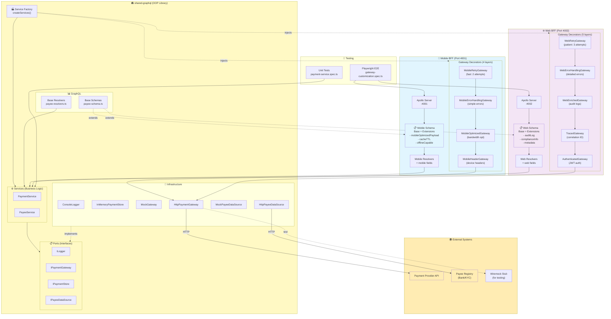

# Architecture Documentation

## Overview

This repository demonstrates an **OOP-based architecture** using SOLID principles with a shared GraphQL library consumed by two Backend-for-Frontend (BFF) services: Mobile and Web. The architecture showcases how to build flexible, maintainable, and testable systems using:

- **SOLID Principles** (Single Responsibility, Open/Closed, Liskov Substitution, Interface Segregation, Dependency Inversion)
- **Decorator Pattern** for gateway customization
- **Factory Pattern** for service composition
- **Dependency Injection** for testability
- **Schema Extension Pattern** for BFF-specific requirements

## Summary

The `shared-graphql` library provides:
- Base GraphQL schemas and resolvers
- Core business services (PaymentService, PayeeService)
- Infrastructure abstractions (ports/interfaces)
- Concrete implementations for testing and production

Two BFF consumers (`mobile-bff`, `web-bff`) extend the shared library with:
- **Custom Gateway Decorators**: Mobile and Web have different downstream communication needs (headers, retry, errors)
- **Schema Extensions**: Mobile needs bandwidth optimization, Web needs rich admin features
- **Custom Resolvers**: Each BFF adds platform-specific fields to responses

The architecture follows SOLID principles by:
- **SRP**: Each class/decorator has one responsibility
- **OCP**: Base code is extended through composition (decorators, schema extensions), never modified
- **LSP**: All gateway decorators implement `IPaymentGateway` and are substitutable
- **ISP**: Small, focused interfaces (IPaymentGateway, IPaymentStore, ILogger)
- **DIP**: Services depend on abstractions, concrete implementations are injected

## Technical Wiring & Dependency Injection

### Service Factory Pattern

The `createServices(overrides?)` factory is the **single composition root** where concrete implementations are wired:

```typescript
// shared-graphql/src/factories/service-factory.ts
export function createServices(overrides?: {
  logger?: ILogger;
  paymentStore?: IPaymentStore;
  paymentGateway?: IPaymentGateway;  // Key injection point
  payeeDataSource?: IPayeeDataSource;
}): SharedServices {
  const logger = overrides?.logger ?? new ConsoleLogger();
  const paymentStore = overrides?.paymentStore ?? new InMemoryPaymentStore();
  
  // Gateway selection (can be overridden by BFFs)
  let paymentGateway: IPaymentGateway;
  if (overrides?.paymentGateway) {
    paymentGateway = overrides.paymentGateway;  // BFF injects custom gateway
  } else if (process.env.USE_WIREMOCK === 'true') {
    paymentGateway = new HttpPaymentGateway(process.env.PAYMENT_STUB_URL);
  } else {
    paymentGateway = new MockGateway();
  }
  
  // Services depend on abstractions (DIP)
  return {
    logger,
    paymentService: new PaymentService(paymentStore, paymentGateway, logger),
    payeeService: new PayeeService(payeeDataSource, logger)
  };
}
```

### Gateway Customization (Decorator Pattern)

**Mobile BFF** and **Web BFF** create custom gateway decorators and inject them:

```typescript
// Mobile BFF
const mobileGateway = CompleteMobileGatewayFactory.create(mobileContext);
const services = createServices({ paymentGateway: mobileGateway });

// Web BFF
const webGateway = CompleteWebGatewayFactory.create(webContext, getUserToken, getRequestId);
const services = createServices({ paymentGateway: webGateway });
```

### Infrastructure Options

- **Payment Gateway**:
  - `MockGateway`: In-memory stub for testing
  - `HttpPaymentGateway`: HTTP client for real provider or Wiremock
  - `MobileHeaderGateway`, `AuthenticatedGateway`, etc.: Decorators adding custom behaviors

- **Payment Store**:
  - `InMemoryPaymentStore`: Default for tests/examples
  - Custom DB implementation (PostgreSQL, MongoDB) can be injected without changing service logic

- **Logger**:
  - `ConsoleLogger`: Default simple logger
  - Production can inject structured logger (Winston, Pino) implementing `ILogger`

- **Payee Data Source**:
  - `MockPayeeDataSource`: Hardcoded test data
  - `HttpPayeeDataSource`: HTTP client for real registry (when `USE_PAYEE_REGISTRY=true`)

## Example Call Flows

### Payment Authorization (Happy Path)

```
Client → Mobile BFF GraphQL → Resolver → PaymentService
                                            ↓
                                    IPaymentStore.create()
                                            ↓
                                    IPaymentGateway.authorize()
                                            ↓
                          [Gateway Decorator Chain]
                          MobileRetryGateway →
                          MobileErrorHandlingGateway →
                          MobileOptimizedGateway →
                          MobileHeaderGateway →
                          HttpPaymentGateway → Downstream API
                                            ↓
                                    IPaymentStore.updateStatus()
                                            ↓
                                    ILogger.info()
                                            ↓
                                    ← Success Response
```

**Key Points**:
1. Resolver delegates to `PaymentService` (thin adapter layer)
2. Service creates pending payment via `IPaymentStore` (persistence abstraction)
3. Service calls `IPaymentGateway.authorize()` (gateway abstraction)
4. **Decorator chain executes** (mobile-specific: retry → error handling → optimization → headers)
5. Service updates status to COMPLETED and logs via `ILogger`
6. Response bubbles back through resolver to client

### Payment Authorization (Failure Path)

If `authorize()` returns failure or throws:
- `MobileErrorHandlingGateway` catches and maps to `MobileError` (simple, actionable)
- `PaymentService` marks payment as FAILED
- `ILogger` logs warning with details
- Resolver returns failure result to client

### Payee Validation Flow

```
Client → Web BFF GraphQL → Resolver → PayeeService
                                         ↓
                                 validateAccountFormat()
                                         ↓
                                 IPayeeDataSource.fetchRegisteredName()
                                         ↓
                                 calculateNameSimilarity()
                                         ↓
                                 ← ValidatePayeeResult {
                                     isValid, confidence, matchLevel,
                                     validationId,      # Web-only
                                     auditLog,          # Web-only
                                     complianceInfo     # Web-only
                                   }
```

**Key Points**:
1. Service validates format using pure helpers (testable, no side effects)
2. If valid, service queries `IPayeeDataSource` (abstraction over registry API)
3. Service calculates name similarity (business logic)
4. **Web BFF resolver adds web-specific fields** (auditLog, complianceInfo, metadata)
5. Result returned with platform-specific extensions

## Gateway Customization Architecture

### Mobile BFF Gateway Stack (4 Decorators)

```typescript
MobileRetryGateway                    // Layer 4: Fast retry (2 attempts, 500ms-2s)
  ↓ wraps
MobileErrorHandlingGateway            // Layer 3: Simple mobile errors
  ↓ wraps
MobileOptimizedGateway                // Layer 2: Response optimization
  ↓ wraps
MobileHeaderGateway                   // Layer 1: Device headers
  ↓ wraps
HttpPaymentGateway                    // Base: HTTP client
```

**Mobile Characteristics**:
- **Headers**: Device ID, platform, app version, biometric status
- **Optimization**: Track processing time, minimize payload
- **Errors**: Simple codes (NETWORK_ERROR, TIMEOUT, INSUFFICIENT_FUNDS)
- **Retry**: Fast (2 max, 500ms-2s delays) for mobile UX

### Web BFF Gateway Stack (5 Decorators)

```typescript
WebRetryGateway                       // Layer 5: Patient retry (3 attempts, 1s-10s)
  ↓ wraps
WebErrorHandlingGateway               // Layer 4: Detailed errors with stack traces
  ↓ wraps
WebEnrichedGateway                    // Layer 3: Audit logs & metadata
  ↓ wraps
TracedGateway                         // Layer 2: Distributed tracing
  ↓ wraps
AuthenticatedGateway                  // Layer 1: JWT authentication
  ↓ wraps
HttpPaymentGateway                    // Base: HTTP client
```

**Web Characteristics**:
- **Auth**: JWT bearer token injection
- **Tracing**: Correlation ID, session ID, trace ID for observability
- **Enrichment**: Audit logs, metadata (user, IP, timestamp)
- **Errors**: Detailed info (stack trace, request ID, recovery steps)
- **Retry**: Patient (3 max, 1s-10s delays) for reliability

### SOLID Benefits

**Single Responsibility**: Each decorator does ONE thing
```typescript
class MobileHeaderGateway {
  // Only adds headers, nothing else
}
```

**Open/Closed**: Extend via composition, never modify base
```typescript
// Base gateway never changes
class HttpPaymentGateway { /* original code */ }

// Extended through wrapping
const gateway = new MobileRetryGateway(
  new MobileErrorHandlingGateway(
    new MobileHeaderGateway(base)
  )
);
```

**Liskov Substitution**: All implement same interface
```typescript
interface IPaymentGateway {
  authorize(...): Promise<AuthorizationResult>;
  capture(...): Promise<CaptureResult>;
  refund(...): Promise<RefundResult>;
}

// Service works with ANY implementation
class PaymentService {
  constructor(private gateway: IPaymentGateway) {}
}
```

## Schema Customization Architecture

### Mobile Schema Extensions

```graphql
# Base schema (shared)
type ValidatePayeeResult {
  isValid: Boolean!
  confidence: Float!
  matchLevel: MatchLevel!
}

# Mobile extensions (mobile-bff/src/custom-schema.ts)
extend type ValidatePayeeResult {
  mobileOptimizedPayload: String!     # Compressed JSON
  offlineCapable: Boolean!            # Can cache?
  cacheTTL: Int!                      # Cache duration
  estimatedDataUsageKB: Float!        # Bandwidth estimate
}

# Mobile-only queries
type Query {
  quickValidatePayee(accountNumber: String!): MobileQuickValidateResult!
  getRecentPayeesMobile(limit: Int = 5): [Payee!]!
}
```

### Web Schema Extensions

```graphql
# Web extensions (web-bff/src/custom-schema.ts)
extend type ValidatePayeeResult {
  validationId: ID!                   # Tracking ID
  auditLog: AuditLog!                 # Complete audit trail
  metadata: ValidationMetadata!       # Rich metadata
  complianceInfo: ComplianceInfo      # KYC/AML/Sanctions
  matchAnalysis: MatchAnalysis!       # Debug details
}

# Web-only queries (admin features)
type Query {
  searchPayees(query: String, filters: PayeeFilters): PayeeSearchResult!
  getValidationHistory(payeeId: ID!): [ValidationHistoryEntry!]!
  getComplianceReport(payeeId: ID!): ComplianceReport!
}

# Web-only mutations (moderation)
type Mutation {
  moderatePayee(payeeId: ID!, action: ModerationAction!): ModerationResult!
  updatePayeeTags(payeeId: ID!, tags: [String!]!): Payee!
}
```

### Schema Extension Pattern Benefits

**Open/Closed Principle**:
- Base schema is **never modified**
- BFFs **extend** with platform-specific needs
- Changes don't affect other consumers

**Separation of Concerns**:
- Shared library: Core business entities
- Mobile BFF: Bandwidth optimization, offline support
- Web BFF: Admin features, compliance, audit

## Testing & Stubbing Patterns

### Unit Testing (Isolated)

```typescript
// Test service with mocks
const mockGateway = createMock<IPaymentGateway>();
const mockStore = new InMemoryPaymentStore();
const mockLogger = createMock<ILogger>();

const service = new PaymentService(mockStore, mockGateway, mockLogger);

// Test business logic in isolation
await service.createPayment(input);
expect(mockGateway.authorize).toHaveBeenCalled();
```

### Decorator Testing (Focused)

```typescript
// Test each decorator independently
describe('MobileHeaderGateway', () => {
  it('adds mobile headers', async () => {
    const mockBase = createMock<IPaymentGateway>();
    const gateway = new MobileHeaderGateway(mockBase, context);
    
    await gateway.authorize(100, 'USD', '123', '456');
    
    // Verify headers added
    expect(mockBase.authorize).toHaveBeenCalled();
  });
});
```

### Integration Testing (E2E)

```typescript
// Test with real HTTP (Wiremock)
// Set USE_WIREMOCK=true, PAYMENT_STUB_URL=http://localhost:8080
const services = createServices(); // Uses HttpPaymentGateway
await services.paymentService.createPayment(input);
// Calls actual HTTP endpoint (stubbed by Wiremock)
```

### BFF Testing (Schema Extensions)

```typescript
// Test mobile-specific fields
const response = await request.post(MOBILE_BFF, {
  data: { query: validatePayeeQuery }
});

expect(response.data.validatePayee.mobileOptimizedPayload).toBeDefined();
expect(response.data.validatePayee.cacheTTL).toBeGreaterThan(0);
```

## Why This Architecture Works

### Flexibility
- Add/remove decorators without changing base code
- Each BFF customizes independently
- Easy to add new platforms (tablet, desktop, API)

### Testability
- Each component testable in isolation
- Mock/stub at any abstraction level
- Focused unit tests for each decorator

### Maintainability
- Small, focused classes (50-100 lines each)
- Clear separation of concerns
- Easy to understand and modify

### Extensibility
- Open for extension via decorators and schema extensions
- Closed for modification (base code never changes)
- New requirements don't break existing code
## Architecture Diagram

### System Overview

The diagram shows the complete architecture with:
- Shared GraphQL library (base functionality)
- Mobile BFF with custom decorators and schema
- Web BFF with custom decorators and schema
- External systems and stubs

**How to render**: Paste the Mermaid block into:
- VS Code with Mermaid Preview extension
- GitHub Markdown viewer
- https://mermaid.live



## Key Files and Directories

### Shared Library (`shared-graphql/`)
- `src/factories/service-factory.ts` - Service composition root (Dependency Injection)
- `src/services/payment-service.ts` - Payment business logic (OOP class)
- `src/services/payee-service.ts` - Payee validation logic (OOP class)
- `src/ports/gateway.ts` - IPaymentGateway interface (abstraction)
- `src/infra/http-gateway.ts` - HTTP implementation (base gateway)
- `src/graphql/payee-schema.ts` - Base GraphQL schema

### Mobile BFF (`mobile-bff/`)
- `src/custom-gateway.ts` - Mobile gateway decorators (4 classes)
  - MobileHeaderGateway, MobileOptimizedGateway, MobileErrorHandlingGateway, MobileRetryGateway
  - CompleteMobileGatewayFactory (composes all decorators)
- `src/custom-schema.ts` - Mobile schema extensions
  - Adds: mobileOptimizedPayload, offlineCapable, cacheTTL, estimatedDataUsageKB
  - Mobile-only queries: quickValidatePayee, getRecentPayeesMobile
- `src/server.ts` - Mobile BFF server (Apollo, port 4001)

### Web BFF (`web-bff/`)
- `src/custom-gateway.ts` - Web gateway decorators (5 classes)
  - AuthenticatedGateway, TracedGateway, WebEnrichedGateway, WebErrorHandlingGateway, WebRetryGateway
  - CompleteWebGatewayFactory (composes all decorators)
- `src/custom-schema.ts` - Web schema extensions
  - Adds: validationId, auditLog, metadata, complianceInfo, matchAnalysis
  - Web-only queries: searchPayees, getValidationHistory, getComplianceReport
  - Web-only mutations: moderatePayee, updatePayeeTags
- `src/server.ts` - Web BFF server (Apollo Express, port 4002)

### Testing (`playwright-e2e/`)
- `tests/gateway-customization.spec.ts` - E2E tests for decorators and schema extensions
- `tests/payee.spec.ts` - Basic payee validation tests

### Documentation
- `OOP_SCHEMA_GATEWAY_GUIDE.md` - Comprehensive guide to OOP architecture
- `Architecture.md` - This file (system overview)
- `README.md` - Quick start guide

## Running the System

### Start Both BFFs

```bash
# Terminal 1: Mobile BFF
cd mobile-bff
npm install
npm start  # Runs on http://localhost:4001

# Terminal 2: Web BFF
cd web-bff
npm install
npm start  # Runs on http://localhost:4002/graphql
```

### Run E2E Tests

```bash
cd playwright-e2e
npm install
npm test  # Runs all tests

# Run specific test suite
npm test gateway-customization.spec.ts
```

### Test with Wiremock (Optional)

```bash
# Start Wiremock stub
cd stubs/wiremock
docker-compose up

# Set environment variables
export USE_WIREMOCK=true
export PAYMENT_STUB_URL=http://localhost:8080

# Start BFFs (they will use HttpPaymentGateway → Wiremock)
cd mobile-bff && npm start
```

## Query Examples

### Mobile BFF Query (Bandwidth Optimized)

```graphql
query ValidatePayeeMobile($input: ValidatePayeeInput!) {
  validatePayee(input: $input) {
    # Base fields
    isValid
    confidence
    matchLevel
    
    # Mobile-specific fields
    mobileOptimizedPayload  # Compressed JSON
    offlineCapable          # Can cache?
    cacheTTL                # Cache duration (seconds)
    estimatedDataUsageKB    # Bandwidth estimate
  }
}

# Mobile-only query
query QuickCheck($accountNumber: String!) {
  quickValidatePayee(accountNumber: $accountNumber) {
    isValid
    confidence
  }
}
```

### Web BFF Query (Rich Admin Features)

```graphql
query ValidatePayeeWeb($input: ValidatePayeeInput!) {
  validatePayee(input: $input) {
    # Base fields
    isValid
    confidence
    matchLevel
    
    # Web-specific fields
    validationId
    auditLog {
      userId
      sessionId
      timestamp
      processingTimeMs
    }
    metadata {
      requestId
      correlationId
      environment
    }
    complianceInfo {
      status
      sanctions { passed }
      aml { riskLevel }
      pep { isPEP }
    }
    matchAnalysis {
      nameScore
      confidence
      factors
    }
  }
}

# Web-only query
query SearchPayees($query: String!, $filters: PayeeFilters) {
  searchPayees(query: $query, filters: $filters) {
    payees {
      id
      name
      riskScore
      kycStatus
      tags
    }
    total
    hasMore
  }
}
```

## Design Patterns Summary

| Pattern | Location | Purpose |
|---------|----------|---------|
| **Decorator** | `*-bff/src/custom-gateway.ts` | Add behaviors without modifying base gateway |
| **Factory** | `shared-graphql/src/factories/` | Create and compose services with dependencies |
| **Dependency Injection** | `createServices(overrides?)` | Inject custom implementations for testing/customization |
| **Schema Extension** | `*-bff/src/custom-schema.ts` | Extend base schema without modification (OCP) |
| **Repository** | `IPaymentStore`, `IPayeeDataSource` | Abstract data access |
| **Adapter** | GraphQL resolvers | Adapt service layer to GraphQL API |

## SOLID Principles Matrix

| Principle | Implementation | Example |
|-----------|---------------|---------|
| **Single Responsibility** | Each decorator, service, schema extension has ONE job | MobileHeaderGateway only adds headers |
| **Open/Closed** | Base code extended via decorators/schema extensions, never modified | HttpPaymentGateway unchanged, wrapped by decorators |
| **Liskov Substitution** | All decorators implement IPaymentGateway, fully substitutable | PaymentService works with ANY IPaymentGateway |
| **Interface Segregation** | Small, focused interfaces (IPaymentGateway, ILogger, IPaymentStore) | Decorators only depend on what they need |
| **Dependency Inversion** | Services depend on abstractions, implementations injected | PaymentService depends on IPaymentGateway, not HttpPaymentGateway |

## Environment Variables

| Variable | Default | Purpose |
|----------|---------|---------|
| `USE_WIREMOCK` | `false` | Use HttpPaymentGateway → Wiremock stub |
| `PAYMENT_STUB_URL` | `http://localhost:8080` | Wiremock endpoint |
| `USE_PAYEE_REGISTRY` | `false` | Use real payee registry vs mock |
| `PAYEE_REGISTRY_URL` | `http://localhost:8080` | Payee registry endpoint |

## Further Reading

- **OOP_SCHEMA_GATEWAY_GUIDE.md** - Deep dive into OOP architecture, SOLID principles, and design patterns
- **GATEWAY_CUSTOMIZATION.md** - Detailed guide for gateway customization scenarios (if exists in FunctionalProgramming branch)
- **shared-graphql/EXTENSION_GUIDE.md** - How to extend the shared library (if exists)

## Rendering This Document

- **VS Code**: Install "Markdown Preview Enhanced" or "Mermaid" extension
- **Online**: Copy mermaid blocks to https://mermaid.live
- **CLI**: 
  ```bash
  npx @mermaid-js/mermaid-cli -i Architecture.md -o architecture.png
  ```
