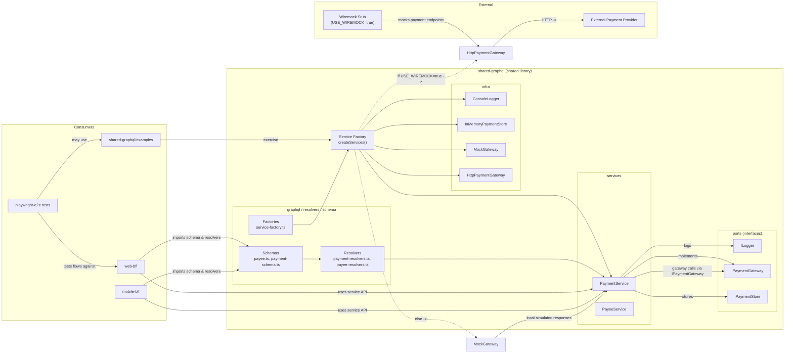

**Architecture Diagram**

- **Summary:** This repository centers a shared library `shared-graphql` that contains business logic, GraphQL schema/resolvers, and service implementations (payment/payee). Two BFF consumers (`mobile-bff`, `web-bff`) import the shared package for GraphQL types/resolvers and use composed services via the `createServices` factory. The shared library follows SOLID principles by depending on small ports (`IPaymentGateway`, `IPaymentStore`, `ILogger`) and composing concrete infra at the application boundary.
 - **Summary:** This repository centers a shared library `shared-graphql` that contains business logic, GraphQL schema/resolvers, and service implementations (payment/payee). Two BFF consumers (`mobile-bff`, `web-bff`) import the shared package for GraphQL types/resolvers and use composed services via the `createServices` factory. The shared library follows SOLID principles by depending on small ports (`IPaymentGateway`, `IPaymentStore`, `ILogger`) and composing concrete infra at the application boundary.

 - **Technical wiring & env flags (detailed):**
   - Composition: `createServices(overrides?)` is the single place where concrete implementations are wired. Tests and examples pass `overrides` (mocks, fakes, or test doubles) to replace `ILogger`, `IPaymentStore`, or `IPaymentGateway` for isolation.
   - Gateway selection: if `overrides.paymentGateway` is provided it is used. Otherwise the factory uses environment wiring: when `USE_WIREMOCK=true` it constructs `HttpPaymentGateway(PAYMENT_STUB_URL||http://localhost:8080)` which forwards to a Wiremock stub; otherwise a local `MockGateway` is used. This makes it easy to switch between fast in-process mocks and a realistic stubbed HTTP surface for integration tests.
   - Store variations: the default `InMemoryPaymentStore` is ideal for unit tests and examples. Replace it with a DB-backed `IPaymentStore` implementation in staging/production without changing service logic.
   - Logger: `ConsoleLogger` is the default simple implementation; production can inject a structured logger implementing `ILogger`.

 - **Example call flows:**
   - Payment creation (happy path):
     1. Client -> BFF GraphQL mutation (`createPayment`).
     2. Resolver (`makePaymentResolvers`) calls `paymentService.createPayment(input)` (the resolver only adapts fields to the service API).
     3. `PaymentService.createPayment` creates a pending payment via `IPaymentStore.create` (persistence responsibility).
     4. The service calls `IPaymentGateway.authorize(...)` to request authorization from the payment provider.
     5. On success, `PaymentService` updates status to `COMPLETED` with `IPaymentStore.updateStatus` and logs via `ILogger`.
     6. Resolver returns the result to the client.

   - Payment creation (failure path):
     1. If `authorize` returns failure, `PaymentService` marks the record `FAILED`, logs a warning, and returns a failure result to the client.

   - Payee validation flow (example):
     1. Client -> BFF GraphQL query for payee validation.
     2. Resolver uses `payee-resolvers` helpers like `calculateNameSimilarity` and `validateAccountNumberFormat` to produce a validation response (pure functions, no I/O).

 - **Testing & stubbing patterns:**
   - Unit tests: inject `MockGateway` and `InMemoryPaymentStore` or test doubles via `createServices({ ...overrides })` for deterministic behavior.
   - Integration/E2E: run Wiremock and set `USE_WIREMOCK=true` with `PAYMENT_STUB_URL` pointing to the stub; the factory will construct `HttpPaymentGateway` so the service talks over HTTP to the stub.

 - **Why this helps (design reasons):**
   - Composition at the application boundary keeps business logic (services, resolvers) independent of concrete infra.
   - Small ports / focused interfaces make substitution and testing straightforward.
   - Environment flags allow realistic integration testing with minimal code changes.
- **Diagram:** Architecture focusing on the `shared-graphql` library and its consumers.
- **How to render:** paste the Mermaid block into a Mermaid-enabled editor (VS Code Mermaid Preview, GitHub Markdown, or https://mermaid.live).



**Notes**
- **Key file:** `src/factories/service-factory.ts` wires logger, store, and gateway selection. It uses `USE_WIREMOCK` to pick `HttpPaymentGateway` vs `MockGateway`.
- **Consumers:** `web-bff` and `mobile-bff` import schemas/resolvers or call services exported by `shared-graphql`. `playwright-e2e` drives end-to-end tests against those BFFs and may call the examples in `shared-graphql/examples`.
- **Infra options:** `InMemoryPaymentStore` (local store), `MockGateway` (in-process stub), `HttpPaymentGateway` (talks to real provider or Wiremock).

**Rendering / Preview**
- VS Code: Install the "Markdown Preview Enhanced" or "Mermaid Markdown Syntax Highlighting" extensions and open `Architecture.md`, then use the preview.
- Online: Paste the mermaid block into https://mermaid.live to preview.
- CLI render (optional):

```bash
# render to PNG using mermaid-cli (npm)
npx @mermaid-js/mermaid-cli -i Architecture.md -o architecture.png
```

If you want I can also add a small SVG/PNG export script or commit a generated image into the repo.
