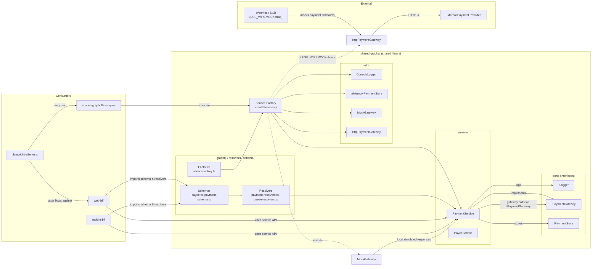

**Architecture Diagram**

- **Diagram:** Architecture focusing on the `shared-graphql` library and its consumers.
- **How to render:** paste the Mermaid block into a Mermaid-enabled editor (VS Code Mermaid Preview, GitHub Markdown, or https://mermaid.live).



**Notes**
- **Key file:** `src/factories/service-factory.ts` wires logger, store, and gateway selection. It uses `USE_WIREMOCK` to pick `HttpPaymentGateway` vs `MockGateway`.
- **Consumers:** `web-bff` and `mobile-bff` import schemas/resolvers or call services exported by `shared-graphql`. `playwright-e2e` drives end-to-end tests against those BFFs and may call the examples in `shared-graphql/examples`.
- **Infra options:** `InMemoryPaymentStore` (local store), `MockGateway` (in-process stub), `HttpPaymentGateway` (talks to real provider or Wiremock).

**Rendering / Preview**
- VS Code: Install the "Markdown Preview Enhanced" or "Mermaid Markdown Syntax Highlighting" extensions and open `Architecture.md`, then use the preview.
- Online: Paste the mermaid block into https://mermaid.live to preview.
- CLI render (optional):

```bash
# render to PNG using mermaid-cli (npm)
npx @mermaid-js/mermaid-cli -i Architecture.md -o architecture.png
```

If you want I can also add a small SVG/PNG export script or commit a generated image into the repo.
