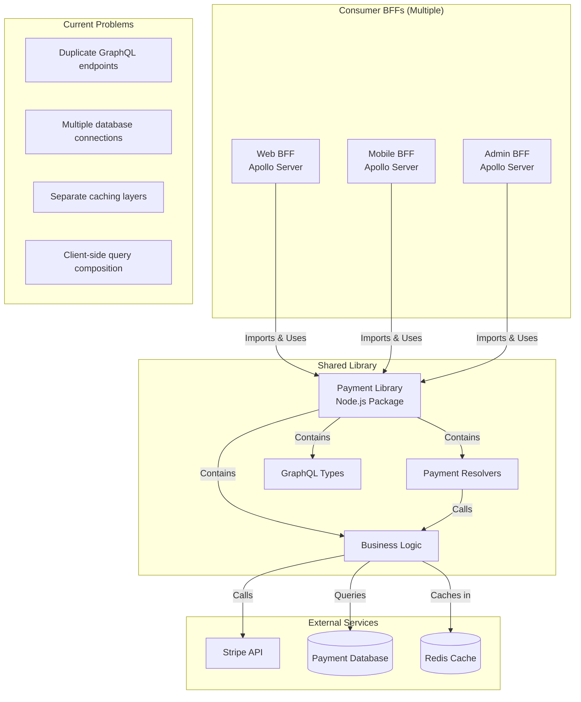
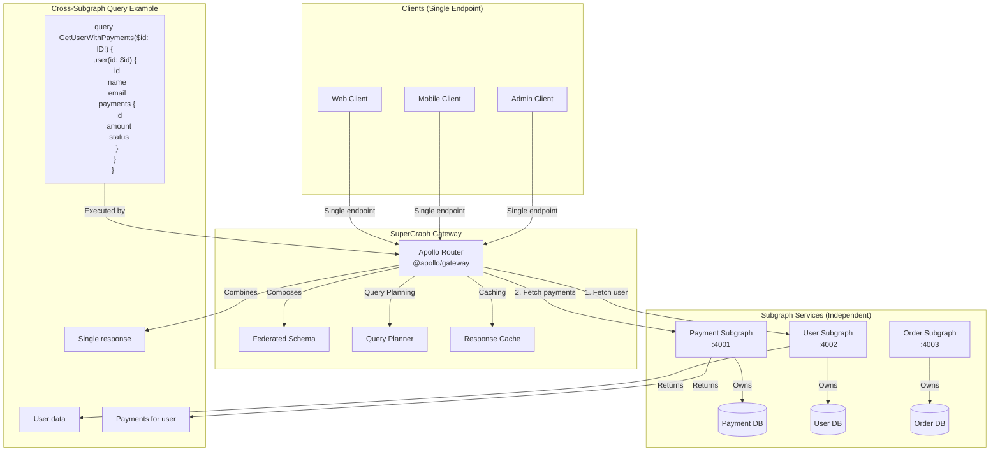

# **Technical Deep Dive: Phase 1 → Phase 2 Migration**

## **1. Phase 1: Shared Library Architecture**

### **Technical Implementation**
```typescript
// Phase 1 Structure: Shared Node.js Package
@company/payment-library/
├── src/
│   ├── resolvers/           # GraphQL resolvers
│   │   ├── payment.resolver.ts
│   │   ├── refund.resolver.ts
│   │   └── webhook.resolver.ts
│   ├── services/           # Business logic
│   │   ├── payment.service.ts
│   │   └── gateway.service.ts
│   ├── types/              # TypeScript types
│   │   ├── payment.types.ts
│   │   └── graphql.types.ts
│   └── index.ts           # Main exports
├── dist/                   # Compiled output
└── package.json

// BFF Usage (Multiple BFFs):
// bff-web/package.json
{
  "dependencies": {
    "@company/payment-library": "^1.0.0"
  }
}

// bff-web/src/resolvers/index.ts
import { 
  paymentResolvers, 
  paymentTypeDefs 
} from '@company/payment-library';

const resolvers = mergeResolvers([
  paymentResolvers,
  bffSpecificResolvers
]);

const typeDefs = mergeTypeDefs([
  paymentTypeDefs,
  bffSpecificTypeDefs
]);
```

### **Data Flow - Phase 1**


## **2. Phase 2: SuperGraph Architecture**

### **Technical Implementation**
```typescript
// Phase 2 Structure: Payment Subgraph Service
payment-subgraph/
├── src/
│   ├── index.ts           # Subgraph server entry
│   ├── schema/
│   │   └── payment.graphql # Federated schema
│   ├── resolvers/         # Federation-ready resolvers
│   │   └── payment.resolver.ts
│   └── services/          # Business logic (migrated from library)
├── Dockerfile
└── package.json

// SuperGraph Gateway:
supergraph-gateway/
├── src/
│   └── index.ts           # Apollo Gateway
├── supergraph.yaml        # Subgraph composition
└── package.json

// Payment Schema with Federation:
// payment.graphql
extend type Query {
  payment(id: ID!): Payment
  payments(filter: PaymentFilter): [Payment!]!
}

type Payment @key(fields: "id") {
  id: ID!
  amount: Float!
  currency: String!
  status: PaymentStatus!
  userId: ID!               # Reference to User subgraph
  orderId: ID               # Reference to Order subgraph
}

type PaymentStatus {
  code: String!
  updatedAt: DateTime!
}

# Entity for cross-subgraph references
extend type User @key(fields: "id") {
  id: ID! @external
  payments: [Payment!]!     # Resolved in Payment subgraph
}
```

### **Data Flow - Phase 2**


## **3. Technical Migration Steps**

### **Step 1: Library → Subgraph Service**
```typescript
// FROM: Shared Library resolver
// @company/payment-library/src/resolvers/payment.resolver.ts
export class PaymentResolver {
  // Regular Apollo resolver
  async getPayment(_, { id }, context) {
    return this.paymentService.getPayment(id);
  }
}

// TO: Federation-ready subgraph resolver
// payment-subgraph/src/resolvers/payment.resolver.ts
export const paymentResolvers = {
  Payment: {
    // Entity resolver for federation
    __resolveReference: async (reference, { dataSources }) => {
      return dataSources.paymentAPI.getPayment(reference.id);
    },
    
    // Field resolver for cross-subgraph fields
    user: async (payment, _, { dataSources }) => {
      // Resolve user from User subgraph
      return { __typename: "User", id: payment.userId };
    }
  },
  
  Query: {
    payment: async (_, { id }, { dataSources }) => {
      return dataSources.paymentAPI.getPayment(id);
    }
  },
  
  // New: Mutation ownership
  Mutation: {
    processPayment: async (_, { input }, { dataSources }) => {
      return dataSources.paymentAPI.processPayment(input);
    }
  }
};
```

### **Step 2: Type Definition Migration**
```graphql
// FROM: Library type definitions (regular GraphQL)
# @company/payment-library - Phase 1
type Payment {
  id: ID!
  amount: Float!
  currency: String!
  status: String!
  user: User!        # Resolved locally in BFF
}

type User {
  id: ID!
  email: String!
  payments: [Payment!]!
}

# TO: Federated schema (Phase 2)
# payment-subgraph/schema/payment.graphql
type Payment @key(fields: "id") {
  id: ID!
  amount: Float!
  currency: String!
  status: PaymentStatus!
  userId: ID!        # Reference field
  user: User         # Stub for federation
}

type PaymentStatus {
  code: String!
  message: String
  updatedAt: DateTime!
}

# In user-subgraph/schema/user.graphql
type User @key(fields: "id") {
  id: ID!
  email: String!
  name: String
  # Payments resolved in payment subgraph
  payments: [Payment!]!
}

extend type Query {
  payment(id: ID!): Payment
  paymentsByUser(userId: ID!): [Payment!]!
}
```

### **Step 3: Service Layer Migration**
```typescript
// FROM: Library service (called from multiple BFFs)
// @company/payment-library/src/services/payment.service.ts
export class PaymentService {
  private db: DatabaseClient; // Each BFF has its own connection
  
  async getPayment(id: string): Promise<Payment> {
    // Direct database access
    return this.db.payments.findUnique({ where: { id } });
  }
}

// TO: Subgraph service (single instance)
// payment-subgraph/src/services/payment.service.ts
export class PaymentService {
  private db: DatabaseClient; // Single connection pool
  
  constructor() {
    // Centralized configuration
    this.db = new DatabaseClient({
      url: process.env.PAYMENT_DB_URL,
      poolSize: 50 // Optimized for single service
    });
  }
  
  async getPayment(id: string): Promise<Payment> {
    // Same business logic, different execution context
    return this.db.payments.findUnique({ where: { id } });
  }
  
  // New: Batch methods for DataLoader optimization
  async getPaymentsBatch(ids: string[]): Promise<Payment[]> {
    return this.db.payments.findMany({
      where: { id: { in: ids } }
    });
  }
}
```

## **4. Deployment & Infrastructure Changes**

### **Phase 1 Infrastructure**
```yaml
# docker-compose.phase1.yml
services:
  bff-web:
    build: ./bff-web
    environment:
      DATABASE_URL: postgresql://payment-db:5432/payments
      REDIS_URL: redis://redis:6379
    depends_on:
      - payment-db
      - redis
  
  bff-mobile:
    build: ./bff-mobile
    environment:
      DATABASE_URL: postgresql://payment-db:5432/payments # Same DB
      REDIS_URL: redis://redis:6379 # Same Redis
  
  payment-db:
    image: postgres:14
    environment:
      POSTGRES_DB: payments
  
  redis:
    image: redis:7-alpine

# Problems:
# - Multiple GraphQL servers
# - Connection pool multiplication (N * poolSize)
# - Cache duplication
# - Load balancing complexity
```

### **Phase 2 Infrastructure**
```yaml
# docker-compose.phase2.yml
services:
  supergraph-gateway:
    build: ./supergraph-gateway
    ports:
      - "4000:4000"
    environment:
      PAYMENT_SUBGRAPH_URL: http://payment-subgraph:4001
      USER_SUBGRAPH_URL: http://user-subgraph:4002
      ORDER_SUBGRAPH_URL: http://order-subgraph:4003
  
  payment-subgraph:
    build: ./payment-subgraph
    environment:
      DATABASE_URL: postgresql://payment-db:5432/payments
      REDIS_URL: redis://payment-redis:6379
  
  user-subgraph:
    build: ./user-subgraph
    environment:
      DATABASE_URL: postgresql://user-db:5432/users
  
  payment-db:
    image: postgres:14
  
  user-db:
    image: postgres:14
  
  payment-redis:
    image: redis:7-alpine

# Benefits:
# - Single GraphQL endpoint
# - Optimized connection pools
# - Dedicated caches per domain
# - Independent scaling
```

## **5. Query Performance Evolution**

### **Phase 1: Client-Side Composition**
```graphql
# Client needs to make multiple requests
# Query 1: Get user
query GetUser($id: ID!) {
  user(id: $id) {
    id
    name
    email
  }
}

# Query 2: Get user's payments
query GetUserPayments($userId: ID!) {
  paymentsByUser(userId: $userId) {
    id
    amount
    status
  }
}

# Problems:
# - Multiple round trips
# - No query optimization
# - Client handles composition
# - Over-fetching common
```

### **Phase 2: Server-Side Federation**
```graphql
# Single query to SuperGraph
query GetUserWithPayments($id: ID!) {
  user(id: $id) {
    id
    name
    email
    payments {           # Resolved by Payment subgraph
      id
      amount
      status
      order {           # Nested resolution from Order subgraph
        id
        items {
          product {
            name
            price
          }
        }
      }
    }
  }
}

# SuperGraph automatically:
# 1. Plans query execution
# 2. Batches requests to subgraphs
# 3. Combines responses
# 4. Handles errors consistently
```

## **6. Migration Strategy (Sequential, Not Parallel)**

### **Week 1-4: Phase 1 Completion**
```typescript
// Finish extracting to shared library
// Goals:
// 1. All payment resolvers in @company/payment-library ✅
// 2. All BFFs using the library ✅
// 3. Comprehensive library tests ✅
// 4. Contract testing established ✅

// Technical debt paid:
// - Consistent payment logic across BFFs
// - Single implementation to maintain
// - Established patterns for extraction
```

### **Week 5-8: Subgraph Preparation**
```typescript
// Prepare library for federation
// 1. Add federation annotations to types
// 2. Create entity resolvers
// 3. Extract database layer to be service-ready
// 4. Add batch query methods for DataLoader

// Library evolves to support both modes:
export class PaymentResolver {
  // Works in both BFF and subgraph contexts
  async getPayment(id: string, context: Context) {
    // Business logic remains the same
    return this.service.getPayment(id);
  }
  
  // New: Federation support
  async __resolveReference(reference: Reference, context: Context) {
    return this.getPayment(reference.id, context);
  }
}
```

### **Week 9-12: SuperGraph Deployment**
```typescript
// Gradual migration to SuperGraph
// Step 1: Deploy payment-subgraph alongside existing BFFs
// payment-subgraph:4001 (new)
// bff-web:4000 (existing)
// bff-mobile:4000 (existing)

// Step 2: Redirect read-only traffic
// Gateway routes GET /payment queries to subgraph
// Mutations still go to BFFs

// Step 3: Full migration
// All payment traffic → payment-subgraph
// BFFs remove payment resolvers
```

## **7. Why Sequential (Not Alternative)**

### **Technical Dependencies**
```typescript
// You CANNOT jump to SuperGraph without Phase 1 because:

// 1. Business logic consolidation needed first
// Before: payment logic scattered across BFFs
// After Phase 1: consolidated in library
// After Phase 2: moved to subgraph

// 2. API contracts must stabilize
// Phase 1: Discover and standardize contracts via shared library
// Phase 2: Formalize as federated schema

// 3. Team skills development
// Phase 1: Learn GraphQL patterns, testing, types
// Phase 2: Learn federation, query planning, distributed systems

// 4. Infrastructure readiness
// Phase 1: Shared library (simple npm package)
// Phase 2: Multiple services, gateway, service mesh
```

### **Risk Management**
```typescript
// Phase 1 (Lower risk):
// - Changes are compile-time (TypeScript)
// - Rollback = npm install previous version
// - No infrastructure changes
// - Teams work independently

// Phase 2 (Higher risk):
// - Changes are runtime (deployed services)
// - Rollback requires deployment
// - Infrastructure coordination needed
// - Cross-team dependencies

// Therefore:
// Phase 1 → Fix domain logic inconsistencies
// Phase 2 → Fix architectural inefficiencies
```

## **8. Technical Benefits Realization**

### **Phase 1 Benefits (Immediate)**
```typescript
// Achieved after shared library:
// 1. Consistent business logic ✅
// 2. Single implementation to fix bugs ✅
// 3. Shared types and interfaces ✅
// 4. Standardized testing patterns ✅
// 5. Faster feature development (write once) ✅

// But still have:
// ❌ Multiple GraphQL endpoints
// ❌ Duplicate database connections  
// ❌ Separate caches
// ❌ Client-side query composition
```

### **Phase 2 Benefits (Future)**
```typescript
// Achieved after SuperGraph:
// 1. Single GraphQL endpoint ✅
// 2. Automatic query optimization ✅
// 3. Centralized response caching ✅
// 4. Cross-service type safety ✅
// 5. Independent team scaling ✅
// 6. Simplified client code ✅

// Building on Phase 1 foundation:
// - Reuse business logic from library
// - Reuse type definitions  
// - Reuse testing patterns
// - Reuse contract tests
```

## **Conclusion**

**Phase 1 (Shared Library) is the foundation. Phase 2 (SuperGraph) is the evolution.**

You're doing it right by:
1. **First** consolidating domain logic (Phase 1)
2. **Then** evolving the architecture (Phase 2)

Trying to implement SuperGraph without first having a consolidated payment domain would be like trying to build a distributed system before you have a working monolith. The shared library phase gives you the stable, tested, well-understood payment domain that can then evolve into a proper subgraph.

**The shared library isn't wasted work when you move to SuperGraph—it becomes the payment subgraph.**